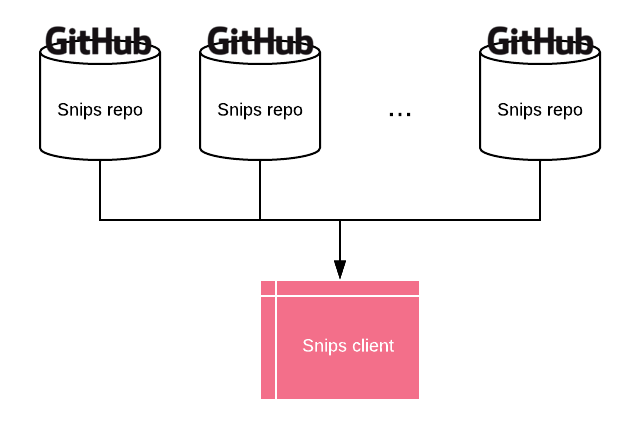

# snips

Snips is a serverless, distributed, compact knowledge database. 

Ever wondered what was that oneliner that saved your ass some time ago ? Those few lines of code that worked really nicely the other day ? 

*Snips* is a an agregator of little bits ('*snips*') of computer-related information, so that you never lose time looking for those again.

[Try it](https://mortrevere.github.io/snips/) on GitHub Pages

### Serverless

Everything, from the client to the *snips* database, is hosted on GitHub. No server to maintain, at all.

### Distributed

Everyone can have a *snips* repo, hosting their precious bits of information. You can then choose a list of repo from where to search from. It could be your own only, or any combination of all the existing *snips* repo.



### Compact

The *whole thing* fits into ~500 lines of code and two third party librairies, for a whopping **198kb** of data (**85kb** compressed). The [*snips* web app](https://mortrevere.github.io/snips/) can be run by anyone and allows searching the whole aggregated *snip* database in a few milliseconds.

## Join the *Snips* network

Any GitHub repo can become part of the *Snips* database. The only condition is to have a valid build up on it.
To do that :

```
git clone https://github.com/mortrevere/snips.git
cd snips
./snips.py build
```

This builds a JSON file under the `build/` dir, which becomes the reference point for your *snips* repo. You can then host it (for free) on GitHub by simply pushing it.

**Snips are stored into the** `snips/` **dir as simple markdown files.**

They however carry additionnal features like date and tags embedding which allow for efficient searching. This is cleaned up by the build process and moved as metadata in the final build file.

## Adding snips

Adding a new *snip* is then very simple : save your note as a `.md` under the `snips/` dir, and :

```
./snips.py build publish
```

Which is a shortcut for :

```
./snips.py build
git add build/main.json
git add snips/*
git commit -m "new snip"
git push
```

Your build file is now updated on the repo and everyone can find that new *snip*

## Other features

*Snips* comes with a simple tool to convert your list of markdown files to a *snips* build.

Current available commands for `snips.py` are :

```
./snips.py list
./snips.py build
./snips.py publish

./snips.py build publish
```


```
↳ ./snips.py list
+-----+------------+-------+--------------------------------------------------------------+
| ID  | DATE       | BUILT | TITLE                                                        |
+-----+------------+-------+--------------------------------------------------------------+
|   0 | 23-06-2019 |  yes  | Full docker cleanup                                          |
|   1 | 23-06-2019 |  yes  | Get your CPU temp on Linux                                   |
|   2 | 23-06-2019 |  yes  | DHCP tools on Linux                                          |
|   3 | 22-06-2019 |  yes  | Disable IPv6 on Linux                                        |
|   4 | 23-06-2019 |  yes  | List of DNS servers                                          |
|   5 | 23-06-2019 |  yes  | Customize the docker ps output                               |
|   6 | 22-06-2019 |  yes  | Turn on forwarding on linux                                  |
|   7 | 23-06-2019 |  yes  | HTML5 minimal document                                       |
|   8 | 22-06-2019 |  yes  | Set up IP forwarding on a Linux host                         |
|   9 | 23-06-2019 |  yes  | Kill processes based on their instanciation args             |
|  10 | 23-06-2019 |  yes  | Setup MariaDB / MySQL server                                 |
|  11 | 22-06-2019 |  yes  | How to send MIDI sysex messages on Linux and program a DX7   |
|  12 | 23-06-2019 |  no   | Using netcat                                                 |
|  13 | 23-06-2019 |  yes  | Cleanup Openstack                                            |
|  14 | 23-06-2019 |  yes  | Openstack flavors                                            |
|  15 | 25-04-2019 |  yes  | Youtube to MP3 on Linux                                      |
+-----+------------+-------+--------------------------------------------------------------+
```

This will be used as a starting point for other utils and to keep track of the state of your snip build.
The `BUILT` column let you know if you have any differences between your local .md files and your build file.

### TODO

- snip client hotlinking
- add `snips.py remove <id>` to remove a snip from the build
- ~~Multi source implementation~~
- ~~Add author on each snip~~

